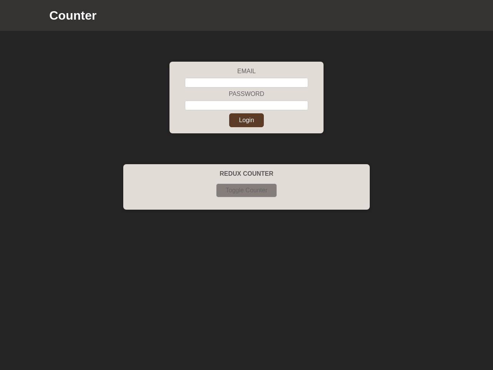

# Counter



## About The Project

Counter is an application built using
React JS. This app uses modern React Hooks such as
useDispatch, useSelector
. This application was
built using Redux toolkit for global state management
The user can increment, decrement in the counter

## Built Using

Counter is built with React JS along with HTML and CSS.
It uses Redux for global state management, NPM as package manager

- React Hooks
- HTML
- CSS
- NPM
- Redux

## Getting Started

To get started with project just simply fork this repo or download locally on your System.

To get a local copy up and running follow these simple example steps.

Prerequisites
Start with the latest version of NPM to avoid any errors:

## Prerequisites

Start with the latest version of NPM to avoid any errors:

```bash
  npm install npm@latest -g
```

## Installation and Deployment

1). Get a firebase account, set up the project and get the project URL.

2). On the firebase console go to hosting and follow the necessary steps by running
commands in the terminal.

3). After successfully executing the firebase commands use the obtained link to access the app

## Available Scripts

In the project directory, you can run:

```bash
 npm start
```

Runs the app in the development mode.
Open http://localhost:3000 to view it in your browser.

```bash
npm run build
```

Builds the app for production to the build folder.
It correctly bundles React in production mode and optimizes the build for the best performance.

The build is minified uses only necessary files, the filenames include the hashes.
Your app is ready to be deployed!

## Usage

- Counter is a simple application allows users to increment,decrement and increment value by 10
- Users can toggle counter and login/logout of app as well.
